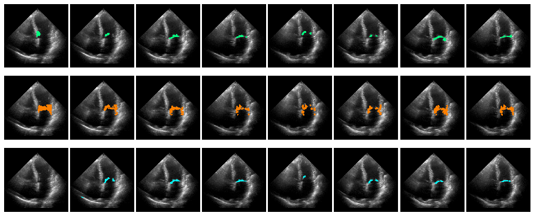

# Neural collaborative filtering for unsupervised mitral valve segmentation in echocardiography



This is the official repository of Neural collaborative filtering for unsupervised mitral valve segmentation in echocardiography. The journal paper
has been published in [Artificial Intelligence in Medicine journal](https://www.sciencedirect.com/science/article/pii/S0933365720312409).

## Requirements
This code is tested on Pytorch 1.3.0. Requirements (including pytroch) can be installed using:
```bash
conda env create -f requirements.yml
```
Activate the environment as 
```bash
source activate mitral_valve_seg
```

## Data
We provide the segmentation labels and the region of interest for the Mitral Valve of 46 videos selected from the publicly available data set EchoNet-Dynamic.
In order to run the code, the corresponding videos need to be downloaded from [EchoNet-Dynamic](https://echonet.github.io/dynamic/) and placed in the respective folder (with the correct video ID) under nn-mitralseg/data/in/raw/echo_net/.
Each folder already contains three mask files (<frame_number_starting_at_1>_mask.png) depicting the segmentation maps and one file (box.jpg) describing the region of interest for the mitral valve.

## Run the model
Once the videos are copied into the correct video ID folders, the model can be run by navigating to the source directroy and running the following command:
```bash
python main.py --config configuration/NNMF.ini
```  
Note: the conda environamte needs first to be activated.

This will load the data, apply the collaborative filtering for each video, predict the segmentation masks for each frame and save the results in the nn-mitralseg/out/SegNNMF/original/<time-stamp> folder.
You can track the progress of the training launching tensorboard as
```bash
tensorboard --logdir runs/*
```  

## When using this code, please cite
@article{corinzia2020neural,
  title={Neural collaborative filtering for unsupervised mitral valve segmentation in echocardiography},
  author={Corinzia, Luca and Laumer, Fabian and Candreva, Alessandro and Taramasso, Maurizio and Maisano, Francesco and Buhmann, Joachim M},
  journal={Artificial Intelligence in Medicine},
  pages={101975},
  year={2020},
  publisher={Elsevier}
}
